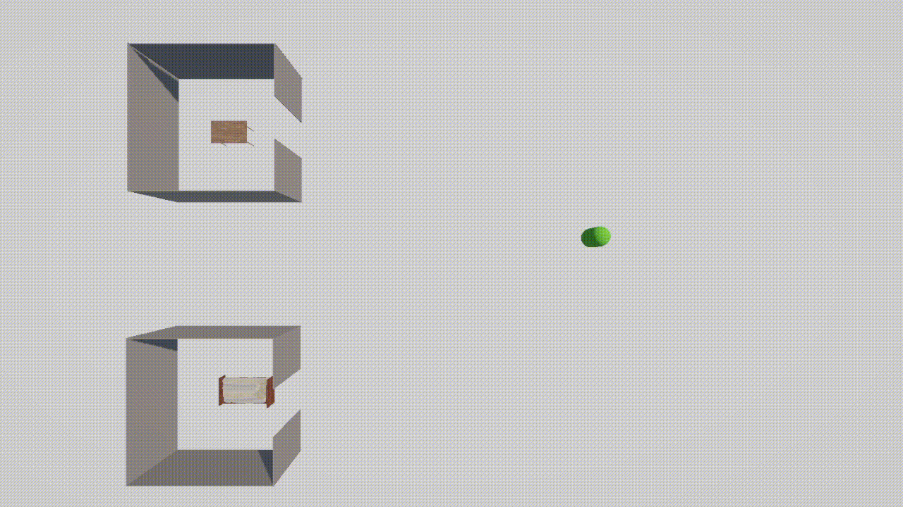
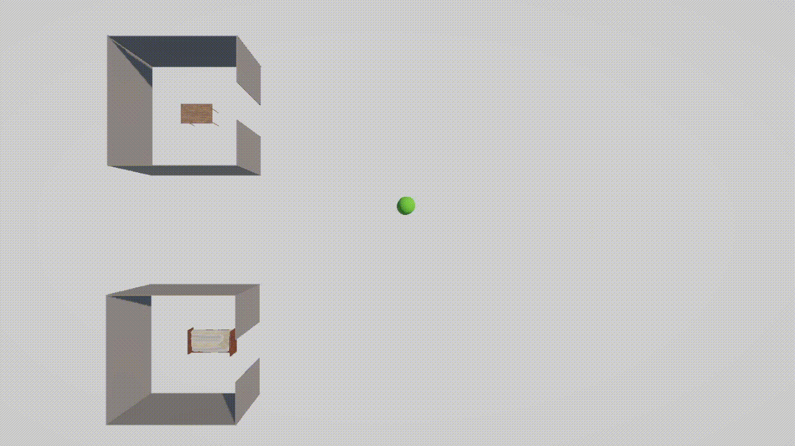
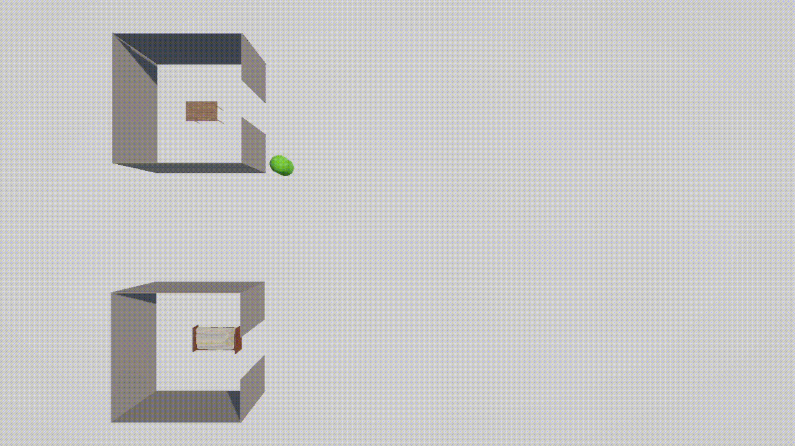

# Module 2: Behavioral AI

Autonomous life simulation for NPCs - a needs-driven finite state machine that lets NPCs live on their own when the player isn't controlling them, feeding the same systemic RPG concept as Module 1






## What it demonstrates

- Left alone, an NPC wanders around the map instead of standing still
- Hunger and sleep rise over time; once a threshold is crossed, the NPC walks to the relevant object and satisfies the need
- If both hunger and sleep are urgent at once, the NPC goes to sleep first, then eats - sleep takes priority
- The NPC navigates around walls and only passes through the doorway, never clips through geometry
- Once a need is satisfied, the NPC returns to idle/wandering automatically, with no scripted trigger from the player

## Features

- **Needs system (`Npcneeds`)** - Hunger, Sleep, and Energy tracked as independent float values that drift over time, exposed as public fields so designers can tune growth/decay rates without touching code
- **Finite state machine (`Npcbehaviour`)** - a plain enum + switch statement (`Idle`, `Wandering`, `MovingToFood`, `Eating`, `MovingToBed`, `Sleeping`) rather than a full behavior-tree framework, kept intentionally simple since the goal was proving the pattern, not building a general-purpose AI framework
- **Priority resolution via ordered checks** - rather than a numeric utility score, competing needs are resolved by checking the higher-priority need first and `return`-ing early, which is easy to read and reason about at this scale
- **Wandering via `NavMesh.SamplePosition`** - random points are validated against the actual navmesh before the agent is sent there, avoiding invalid destinations off the walkable surface
- **NavMesh-driven pathing** - built on Unity's `NavMeshAgent`/`NavMeshSurface`, so wall avoidance and doorway pathfinding come from baked navigation data 

## Tech stack

- Unity 6 (URP)
- Unity AI Navigation (NavMeshSurface / NavMeshAgent)
- C#

## Project structure

```
Assets/
  Scripts/
    Npcneeds.cs        - hunger/sleep/energy values and their rates of change
    Npcbehaviour.cs    - finite state machine driving NavMeshAgent based on Npcneeds
  Scenes/
    SampleScene.unity  - test scene with one NPC, a food table, a bed, and a walled room with a doorway
```

## How to run

1. Clone the repository
2. Open the project in Unity 6 (or later) with URP
3. Open `Assets/Scenes/SampleScene.unity`
4. Enter Play mode
5. Watch the NPC for a minute or two; hunger and sleep rise on their own and the NPC reacts automatically

## Known limitations (by design, for this module's scope)

- Single NPC, single food target, single bed target - multi-NPC scaling wasn't the point of this prototype
- Energy is tracked and regenerates during sleep, but doesn't yet affect behavior (e.g. movement speed)
- No visual state indicator (icon/text above the NPC's head) showing its current state
- No possession integration yet - this module assumes the NPC is never player-controlled

## Roadmap

- [ ] Multiple NPCs and multiple targets running simultaneously
- [ ] Energy affecting movement speed or available actions
- [ ] On-screen state indicator for debugging/demo clarity
